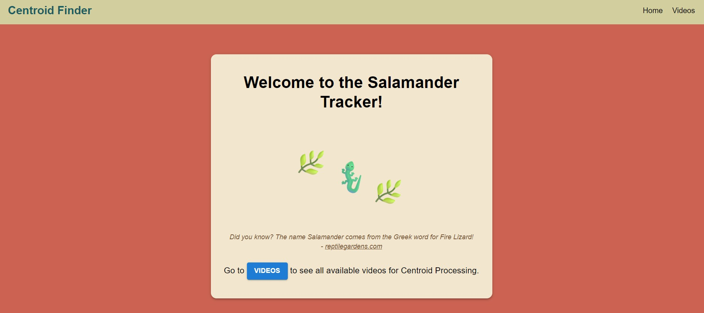
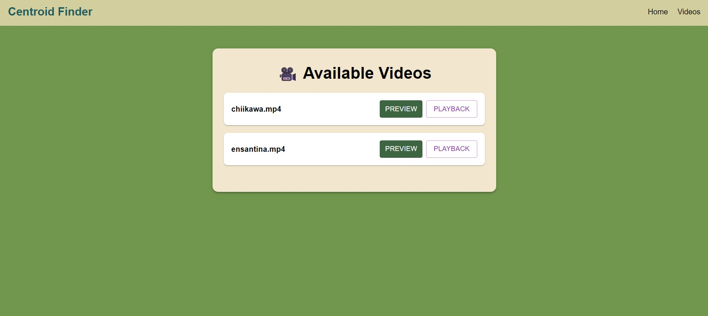
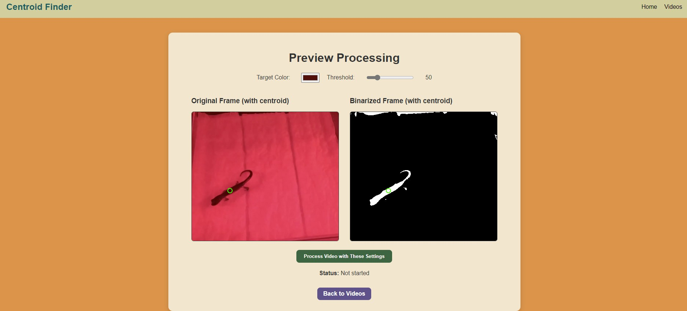
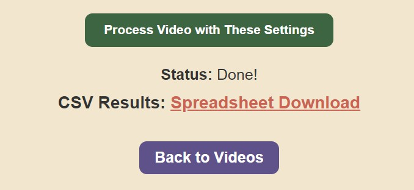

# 🦎 Salamander Tracker – Web Application Guide

Welcome to the Salamander Tracker! This web app lets you explore wildlife videos, highlight target colors (like salamanders), and download tracking results.

There are **4** main pages. This guide walks through what each one does.

---

## 🏠 1. Home Page
 

The Home page is a simple starting point.

**What you can do:**

- 🧭 Use the top navigation bar to browse the app.
- 🎥 Click the **“Videos”** button to view all available video clips and get started.

This page provides a quick entry into the video browser. You can always return here by clicking the home link in the navigation bar.

---

## 📺 2. Video Selection Page
   

This is where you select a video to work with.

**What you can do:**

- 🔍 Browse available video clips stored on the server.
- ▶️ Click the **“Preview”** button next to any video to view it and customize tracking settings.
- 🎞️ Click the **“Playback”** button to download the original video file locally to your computer to view it.

---

## 🧪 3. Preview & Customize Page

This page shows a preview frame from the video and lets you adjust your tracking settings.

**What you see:**

- 🖼 Two video frames:
  - Left: Original frame with a green circle showing the detected object.
  - Right: Binarized (black & white) frame showing where the system sees the matching color.

**What you can adjust:**

- 🎨 Target Color: Pick the color of the object you want to track (like a salamander).
- 🛠 Threshold: Move the slider to adjust how closely the system matches the color.
  - Lower = *stricter* match
  - Higher = *looser* match

🔁 The preview updates automatically when you change these settings.

✅ When you're happy, click:

- **▶️ “Process Video with These Settings”** to start tracking the object across the full video.

---

## ⏱️ 4. Processing & Download Page

After you start processing:

- ⏳ The status message shows:
  - **“Processing…”** while it’s working
  - **“Done!”** when finished
  - Or an error if something goes wrong

Once it's done:

- 📄 A link appears to download a *CSV* file with tracking results, as a spreadsheet.

You can also:

- 🔙 Click **“Back to Videos”** to explore more clips.

---

## ℹ️ Tips

- If you don’t see a green circle or white pixels in the preview:
  - Try picking a more accurate **color**
  - Increase the **threshold** slider
- The green circle shows the center of the largest color-matching object in the frame
- The downloaded CSV file includes:
  - Timestamp
  - X and Y coordinates for each second of video

---
